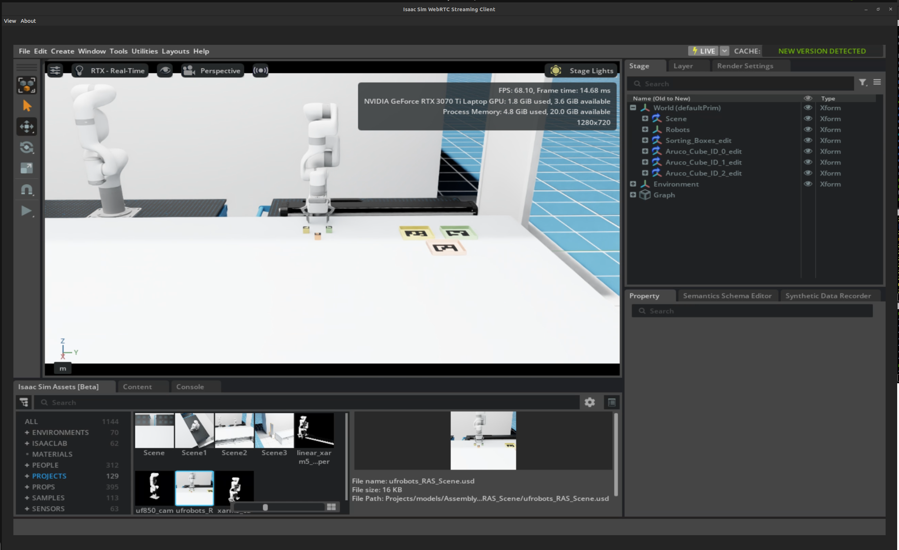

# Demo-2_vision-based-sorting

## Project Overview

This project demonstrates vision-based pick-and-place of objects using Aruco tags to identify and differentiate objects for sorting. The demo is implemented on the Ufactory xArm5 robot and uses an Intel RealSense D435i depth camera.

A digital twin of The National Robotarium (NR) RAS lab cobot station was created in NVIDIA Isaac Sim, and the software is implemented using ROS2, MoveIt2, and NVIDIA Isaac Sim Omnigraph.

## Setup


<details>
<summary id="xarm-ros2-workspace-setup-and-usage">🛠️ xArm ROS2 Workspace Setup and Usage</summary>

This repository provides instructions to set up a ROS2 workspace for the xArm manipulator, including optional camera calibration, MoveIt2 tutorials, and the xArm Python SDK. It also documents useful ROS2 services to control the robot, gripper, and linear motor.

**Prerequisites**

- ROS2 (e.g., Humble Hawksbill) installed and sourced.
- `git`, `colcon`, `vcs`, and ROS2 dependencies (`rosdep`).
- Appropriate permissions to install packages (`sudo` access).


### 🔧 Create Workspace

```bash
# Skip this step if you already have a target workspace
cd ~
mkdir -p dev_ws/src
cd ~/dev_ws/src
```

### 📂 Clone Repositories

```bash
# Change the branch as required
git clone https://github.com/rahul-theroboticist/Demo-2_vision-based-sorting.git --branch small
```


### ⚙️ Build Workspace

```bash
cd ~/dev_ws
sudo apt update
rosdep install -r --from-paths src --ignore-src --rosdistro $ROS_DISTRO -y
colcon build --mixin release
```

</details>

<details>
<summary id="optional-camera-calibration">📷 Optional: Camera Calibration</summary>

If you need camera calibration and MoveIt2 tutorials, run:

```bash
cd ~/dev_ws/src
# Clone MoveIt2 tutorials for Humble
git clone https://github.com/ros-planning/moveit2_tutorials --branch humble
# Clone calibration package
git clone git@github.com:adipdas11/moveit2_calibration.git

# Import repositories
vcs import < moveit2_tutorials/moveit2_tutorials.repos

# Install dependencies and rebuild
cd ~/dev_ws
rosdep install -r --from-paths src --ignore-src --rosdistro $ROS_DISTRO -y
colcon build --mixin release
```

</details>

<details>
<summary id="optional-python-sdk-for-xarm">🐍 Optional: Python SDK for xArm</summary>

To control the xArm via Python:

```bash
cd ~/dev_ws/src
git clone https://github.com/xArm-Developer/xArm-Python-SDK.git
cd xArm-Python-SDK
python3 setup.py install
pip3 install xarm-python-sdk
```
</details>


## Setup ISAAC Sim

<details>
<summary id="setup-isaacsim-assets">⚙️ Setup NVIDIA Isaac Sim Assets Properly</summary>

### Prerequisites

Make sure you have NVIDIA Isaac Sim 4.5.0 installed and sourced in your environment. Then, install necessary tools and dependencies if any.

All three packs of Isaac Sim Assets latest release can be found here: https://docs.isaacsim.omniverse.nvidia.com/latest/installation/download.html#isaac-sim-latest-release

```bash
# Download all three packs of Isaac Sim Assets and then unzip packages to a folder.
mkdir ~/isaacsim_assets
cd ~/Downloads
unzip "isaac-sim-assets-1@4.5.0-rc.36+release.19112.f59b3005.zip" -d ~/isaacsim_assets
unzip "isaac-sim-assets-2@4.5.0-rc.36+release.19112.f59b3005.zip" -d ~/isaacsim_assets
unzip "isaac-sim-assets-3@4.5.0-rc.36+release.19112.f59b3005.zip" -d ~/isaacsim_assets

# Edit the isaacsim.exp.base.kit file:
[settings]
persistent.isaac.asset_root.default = "/home/<username>/isaacsim_assets/Assets/Isaac/4.5"
exts."isaacsim.asset.browser".folders = [
  "/home/<username>/isaacsim_assets/Assets/Isaac/4.5/Isaac/Robots",
  "/home/<username>/isaacsim_assets/Assets/Isaac/4.5/Isaac/People",
  "/home/<username>/isaacsim_assets/Assets/Isaac/4.5/Isaac/IsaacLab",
  "/home/<username>/isaacsim_assets/Assets/Isaac/4.5/Isaac/Props",
  "/home/<username>/isaacsim_assets/Assets/Isaac/4.5/Isaac/Environments",
  "/home/<username>/isaacsim_assets/Assets/Isaac/4.5/Isaac/Materials",
  "/home/<username>/isaacsim_assets/Assets/Isaac/4.5/Isaac/Samples",
  "/home/<username>/isaacsim_assets/Assets/Isaac/4.5/Isaac/Sensors",
  "/home/<username>/isaacsim_assets/Assets/Isaac/4.5/Isaac/Projects",
]

# Run Isaac Sim with local assets:
./isaac-sim.sh --/persistent/isaac/asset_root/default="/home/<username>/isaacsim_assets/Assets/Isaac/4.5"
```

</details>

<details>
<summary id="run-isaacsim-scene">▶️ Run Isaac Sim and Load the NR RAS Cobot Scene</summary>

```bash
# Launch Isaac Sim
cd ~/isaacsim
./isaac-sim.sh
```

Once Isaac Sim is loaded, open the Assets browser, navigate to your projects folder, and load:

```
isaac_assets/models/Assembly_Models/ufrobots_RAS_Scene/ufrobots_RAS_Scene.usd
```

</details>

## Robot Services

<details>
<summary id="useful-services">⚙️ Useful Services to Control xArm and xArm Gripper</summary>

Below are the primary ROS2 services for controlling the xArm manipulator and its peripherals.

**Pose Planning**

- **Service:** `/xarm_pose_plan`
- **Type:** `xarm_msgs/srv/PlanPose`
- **Request Format:**
  ```ros
  geometry_msgs/Pose target
  ---
  bool success
  ```
- **Example:**
  ```bash
  ros2 service call /xarm_pose_plan xarm_msgs/srv/PlanPose "{target:
       {position:   {x: 0.3,   y: -0.1,  z: 0.2},
        orientation:{x: 1.0,   y:  0.0,  z: 0.0,  w: 0.0}
       }
     }"
  ```

**Execute Plan**

- **Service:** `/xarm_exec_plan`
- **Type:** `xarm_msgs/srv/PlanExec`
- **Request Format:**
  ```ros
  bool wait
  ---
  bool success
  ```
- **Example:**
  ```bash
  ros2 service call /xarm_exec_plan xarm_msgs/srv/PlanExec "{wait: true}"
  ```

**Gripper Joint Planning**

- **Service:** `/xarm_gripper_joint_plan`
- **Type:** `xarm_msgs/srv/PlanJoint`
- **Request Format:**
  ```ros
  float64[] target
  ---
  bool success
  ```
- **Examples:**
  - **Close Gripper**
    ```bash
    ros2 service call /xarm_gripper_joint_plan xarm_msgs/srv/PlanJoint "{ target: [0.85, 0.85, 0.85, 0.85, 0.85, 0.85] }"
    ```
  - **Open Gripper**
    ```bash
    ros2 service call /xarm_gripper_joint_plan xarm_msgs/srv/PlanJoint "{ target: [0.0, 0.0, 0.0, 0.0, 0.0, 0.0] }"
    ```

**Gripper Execution**

- **Service:** `/xarm_gripper_exec_plan`
- **Type:** `xarm_msgs/srv/PlanExec`
- **Request Format:**
  ```ros
  bool wait
  ---
  bool success
  ```
- **Example:**
  ```bash
  ros2 service call /xarm_gripper_exec_plan xarm_msgs/srv/PlanExec "{wait: true}"
  ```

**Linear Motor Control**

- **Service:** `/move_linear_motor`
- **Type:** `ufactory_linear_motor_description/srv/MoveLinearMotor`
- **Request Format:**
  ```ros
  float64 target_position_m
  ---
  bool success
  string message
  ```
- **Example (move to 0.7 m):**
  ```bash
  ros2 service call /move_linear_motor ufactory_linear_motor_description/srv/MoveLinearMotor "{target_position_m: 0.7}"
  ```

</details>

## Demo 2 (Aruco based pick and place using xArm5 and xArm gripper) 

<details>
<summary id="command-lines-for-running-them-individually">🏃‍♂️ Command Lines for Running Demo2 (Aruco based pick and place using xArm5 and xArm gripper) Individually</summary>

```bash
ros2 launch realsense2_camera rs_launch.py depth_module.depth_profile:=1280x720x30 pointcloud.enable:=true

ros2 run xarm5_vision_pick_place aruco_cube_detection.py --ros-args -p mode:=real 

ros2 launch xarm_moveit_config xarm5_linear_moveit_realmove.launch.py  robot_ip:=192.168.1.239

ros2 run xarm5_vision_pick_place aruco_pick_place.py
```

</details>

## Isaacsim-WebRTC

<details>
<summary id="isaacsim-docker-webrtc">🏃‍♂️ Demo showing Nvidia Isaac Sim hosted using the web client.</summary>


**Isaac Sim Container Installation**

Perform the container installation of Isaac Sim following the [official documentation](https://docs.isaacsim.omniverse.nvidia.com/latest/installation/install_container.html).


```bash

mkdir isaac-sim-docker

cd isaac-sim-docker/

touch Dockerfile

nano Dockerfile

```

Add these contents into the docker file

```bash
FROM nvcr.io/nvidia/isaac-sim:4.5.0

RUN apt-get update && apt-get -y upgrade

# Configure persistent asset paths
RUN echo '[settings]' >> /isaac-sim/apps/isaacsim.exp.base.kit && \
    echo 'persistent.isaac.asset_root.default = "/isaac-sim/isaacsim_assets/Assets/Isaac/4.5"' >> /isaac-sim/apps/isaacsim.exp.base.kit && \
    echo 'exts."isaacsim.asset.browser".folders = [' >> /isaac-sim/apps/isaacsim.exp.base.kit && \
    echo '  "/isaac-sim/isaacsim_assets/Assets/Isaac/4.5/Isaac/Projects",' >> /isaac-sim/apps/isaacsim.exp.base.kit && \
    echo ']' >> /isaac-sim/apps/isaacsim.exp.base.kit
```
Build docker file

```bash

docker build -t isaacsim:nr . 

```
Generate the build and run files for easy control

```bash
touch build.sh

touch run.sh

chmod +x build.sh

chmod +x run.sh
```
Make a working directory
```bash
mkdir demo2_ws

```
Create a folder to access the custom assets
```bash
mkdir isaacsim_assets

```

Add this to the build file

```bash
docker build -t isaacsim:nr .
```

Add this to the run.sh file

```bash
docker run --name isaac-sim --entrypoint bash -it --runtime=nvidia --gpus all -e "ACCEPT_EULA=Y" --rm ->
    -e "PRIVACY_CONSENT=Y" \
    -v ~/docker/isaac-sim/cache/kit:/isaac-sim/kit/cache:rw \
    -v ~/docker/isaac-sim/cache/ov:/root/.cache/ov:rw \
    -v ~/docker/isaac-sim/cache/pip:/root/.cache/pip:rw \
    -v ~/docker/isaac-sim/cache/glcache:/root/.cache/nvidia/GLCache:rw \
    -v ~/docker/isaac-sim/cache/computecache:/root/.nv/ComputeCache:rw \
    -v ~/docker/isaac-sim/logs:/root/.nvidia-omniverse/logs:rw \
    -v ~/docker/isaac-sim/data:/root/.local/share/ov/data:rw \
    -v ~/docker/isaac-sim/documents:/root/Documents:rw \
    -v ~/isaac-sim-docker/demo2_ws:/isaac-sim/demo2_ws:rw \
    -v ~/isaac-sim-docker/isaacsim_assets:/isaac-sim/isaacsim_assets:rw \
    isaacsim:nr
```

Build the application
```bash
./build.sh
```

Run the applicaion 
```bash
./run.sh
```

**WebRTC for GUI**

Download the Nvidia web rtc application from the [official website](https://docs.isaacsim.omniverse.nvidia.com/latest/installation/manual_livestream_clients.html)


Run the application

```bash
cd ~/Downloads
./isaacsim-webrtc-streaming-client-1.0.6-linux-x64.AppImage 
```

Now the WebRTC-Nvidia container link is established. Make your packages and modification in the demo2_ws folder, which will be linked to the container and its applications.


**Working with VS Code**
Open VS code and connect with the running container following this [instruction](https://learn.microsoft.com/en-us/visualstudio/docker/tutorials/docker-tutorial).

**Run Isaac Sim with WebRTC**

```bash
./isaac-sim.streaming.sh --allow-root 
```

**Custom Assets**
Edit the isaac sim file available in /isaac-sim/apps/isaacsim.exp.base.kit

Add the following code to create a custom project folder

```
[settings]
persistent.isaac.asset_root.default = "/home/isaac-sim/isaacsim_assets/Assets/Isaac/4.5"
exts."isaacsim.asset.browser".folders = [
  "/home/isaac-sim/isaacsim_assets/Assets/Isaac/4.5/Isaac/Projects",
]
```
Run IsaacSIm WebRTC with custom asset library added
```
./isaac-sim.streaming.sh --/persistent/isaac/asset_root/default="/isaac-sim/isaacsim_assets/Assets/Isaac/4.5" --allow-root

```

Isaacsim WebRTC loaded with custom assets




**ROS2 Installation - In progress**

```bash

apt update
apt install locales
locale-gen en_US en_US.UTF-8
update-locale LC_ALL=en_US.UTF-8 LANG=en_US.UTF-8
export LANG=en_US.UTF-8

apt install software-properties-common -y
add-apt-repository universe -y
apt update
apt install curl -y
curl -sSL https://raw.githubusercontent.com/ros/rosdistro/master/ros.key -o /usr/share/keyrings/ros-archive-keyring.gpg

echo "deb [arch=$(dpkg --print-architecture) signed-by=/usr/share/keyrings/ros-archive-keyring.gpg] http://packages.ros.org/ros2/ubuntu $(. /etc/os-release && echo $UBUNTU_CODENAME) main" | tee /etc/apt/sources.list.d/ros2.list > /dev/null

apt update && apt install -y \
  python3-flake8-docstrings \
  python3-pip \
  python3-pytest-cov \
  ros-dev-tools

apt install -y \
   python3-flake8-blind-except \
   python3-flake8-builtins \
   python3-flake8-class-newline \
   python3-flake8-comprehensions \
   python3-flake8-deprecated \
   python3-flake8-import-order \
   python3-flake8-quotes \
   python3-pytest-repeat \
   python3-pytest-rerunfailures

mkdir -p ~/isaac-sim/ros2_humble/src
cd ~/isaac-sim/ros2_humble/
vcs import --input https://raw.githubusercontent.com/ros2/ros2/humble/ros2.repos src


apt upgrade
rosdep init
rosdep update
rosdep install --from-paths src --ignore-src -y --skip-keys "fastcdr rti-connext-dds-6.0.1 urdfdom_headers"
```
</details>
